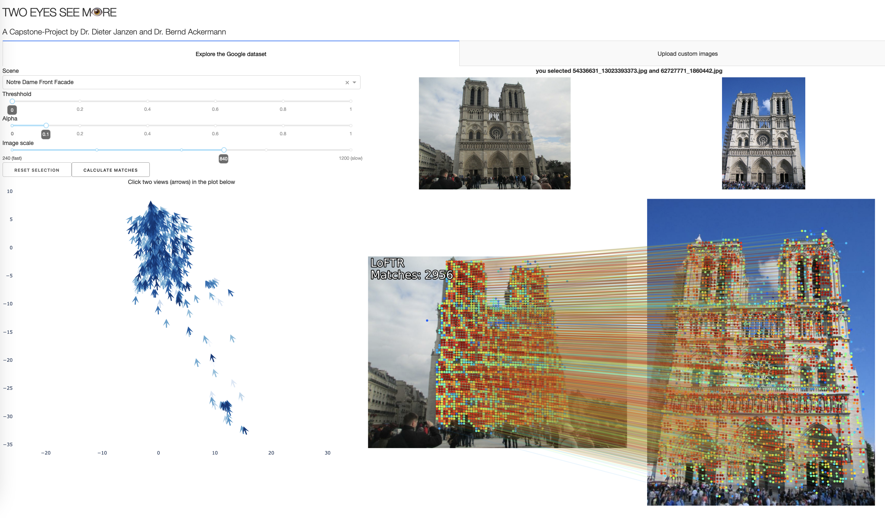

# Two Eyes See M👁️re - A Capstone Project by Dieter Janzen and Bernd Ackermann

*This repository was created as our final capstone project to finish the [neuefische Data Science bootcamp](https://www.neuefische.de/en/bootcamp/data-science). You can also look at the slides of our [final presentation](presentation.pdf) and hopefully soon find a recording of it on the [neuefische Youtube channel](https://www.youtube.com/c/neuefische)*

Position-based image matching is used in 3D scanning of real objects under normally calibrated conditions. Using [LoFTR](https://zju3dv.github.io/loftr/), we match images regardless of size, lighting conditions, obstacles, and even photo filters, enabling the first step in digital 3D preservation of monuments and landmarks from mixed public images.

The [EDA notebook](notebooks/EDA.ipynb) gives an overview over the dataset.

The [LoFTR notebook](models/LoFTR/LoFTR.ipynb) demonstrates how to run LoFTR with PyTorch and how to plot matched images. The standalone [Python script](models/LoFTR/LoFTR.py) can be used to calculate matches for all possible image pairs in a given folder.

A dashboard, created using Plotly Dash, makes it easy to navigate through the dataset, plot matches for all image pairs, and even allows matching of uploaded custom images. 



To use it after setup (see below), start the virtual environment, navigate to [dashboard](dashboard/)

```BASH
source .venv/bin/activate
cd dashboard
```

and run the app from the dashboard-folder:

```BASH

python app.py
```

The dashboard can then be reached in a browser at [127.0.0.1:8050](http://127.0.0.1:8050).

## Requirements

- [pyenv](https://github.com/pyenv/pyenv) with Python 3.9.8
- Data from the [Image Matching Challenge 2022](https://www.kaggle.com/competitions/image-matching-challenge-2022/data).

### Setup

Use the requirements file in this repo to create a new environment:

```BASH
make setup
```

or

```BASH
pyenv local 3.9.8
python -m venv .venv
source .venv/bin/activate
pip install --upgrade pip
pip install -r requirements.txt
```
